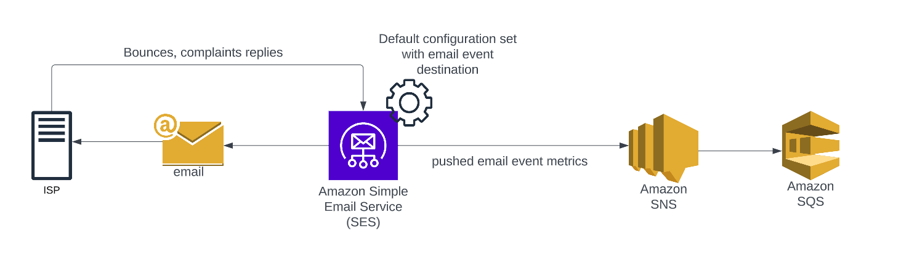

# AWS SES



This module contains resources for AWS Simple Email Service configuration with ability to enable collection of email events metrics for monitoring purposes.
For more details around the topic see:
- [creating SES indentities](https://docs.aws.amazon.com/ses/latest/dg/creating-identities.html)
- [Set up email sending with Amazon SES](https://docs.aws.amazon.com/ses/latest/dg/send-email.html)
- [monitor using event publishing](https://docs.aws.amazon.com/ses/latest/dg/monitor-using-event-publishing.html)
- [handling bounces and complaints](https://aws.amazon.com/blogs/messaging-and-targeting/handling-bounces-and-complaints/)

## Email identities

If you want to send emails using email identity via Amazon SES, you have to create and verify this email indentity. \
Define list of email addresses for which to create email identities within `emails` terraform module variable. Once created, you have to verify email addresses by clicking on verification link send to specified email address.

```
emails = [
  "example_user@example_domain.com",
  "example_user2@example_domain2.com"]
```

## Domain and Subdomain identities

You can decide to create domain or subdomain SES identity. Domain identities are verified via DKIM DNS records. Verification at the domain level extends to all email addresses under one verified domain identity.

```
domains = {
    "DOMAIN_NAME" = {
      zone_id             = "ROUTE_53-zone-id"   # If Domain is managed via Route53, provide zone ID for dns records creation
      verify              = true                 # Creates amazonses verification dns record in route53 for domain verification
      dkim_records        = true                 # Creates dkim txt dns records in route53 for domain verification
      send_policy_enabled = false                # To authorize a delegate sender to send emails using an email address or domain
    }
  }
```

## IAM SMTP user

If you need to send emails via Amazon SES SMTP interface, you have to create IAM user with appropriate IAM policices for email sending

```
  create_smtp_user                          = true
  smtp_user_ses_policy_additional_resources = []  # additional resources arns which can send emails using this IAM user via SMTP
```

## Configuration set

Configuration sets are groups of rules that you can apply to your verified identities
```
  # NOTE: It is possible to set default configuration set for SES identity only via management console
  create_configuration_set = true
  config_sets = {
    "default" = {                              # Configuration set name
      tls_policy                 = "Require"
      reputation_metrics_enabled = false       # Enable Amazon SES to track bounce and complaint metrics in CloudWatch for messages sent using this configuration set
      sending_enabled            = true
    }
  }
```

## Event destination
Event destinations allow you to publish outgoing email tracking actions to other AWS services for monitoring. \
Currently supported AWS services as event destination within this module is AWS SNS.
```
create_ses_sns_event_destinations = true
  ses_sns_event_destinations = {
    "sns-publish" = {
      configuration_set_name           = "default"            # choose one of the configuration set name
      event_destination_matching_types = ["reject", "bounce", "complaint", "delivery", "renderingFailure"]
      sns_destination_name             = "email-events"
    }
  }
```

## SNS topic configuration
If you enable event destination configuration in this module, you have to create SNS topic

```
create_ses_sns_topics = true
  ses_sns_topics = {
    "email-events" = {          # SNS topic name needs to match desired sns_destination_name in event_destination configuration
      subscribe_to_sqs = true
    }
  }
````

<!-- BEGIN_TF_DOCS -->
## Example

```hcl
module "ses_example" {
  source = "../"

  namespace   = local.namespace
  environment = local.environment
  stage       = local.stage
  name        = local.name
  attributes  = [""]
  tags        = local.tags

  emails = ["example_user@example_domain.com"]

  domains = {
    "${data.terraform_remote_state.dns.outputs.public_root_zone_name}" = {
      zone_id             = "${data.terraform_remote_state.dns.outputs.public_root_zone_id}"
      verify              = true
      dkim_records        = true
      send_policy_enabled = false
    }
  }
  create_smtp_user                          = true
  smtp_user_ses_policy_additional_resources = []

  # NOTE: It is possible to set default configuration set for SES identity only via management console
  create_configuration_set = true
  config_sets = {
    "default" = {
      tls_policy                 = "Require"
      reputation_metrics_enabled = false
      sending_enabled            = true
    }
  }

  create_ses_sns_event_destinations = true
  ses_sns_event_destinations = {
    "sns-publish" = {
      configuration_set_name           = "default"
      event_destination_matching_types = ["reject", "bounce", "complaint", "delivery", "renderingFailure"]
      sns_destination_name             = "email-events"
    }
  }

  create_ses_sns_topics = true
  ses_sns_topics = {
    "email-events" = {
      subscribe_to_sqs = true
    }
  }
}
```

## Requirements

| Name | Version |
|------|---------|
| <a name="requirement_terraform"></a> [terraform](#requirement\_terraform) | ~> 1.5.0 |
| <a name="requirement_aws"></a> [aws](#requirement\_aws) | ~> 5.22.0 |
| <a name="requirement_kubernetes"></a> [kubernetes](#requirement\_kubernetes) | >= 2.16.0 |
| <a name="requirement_utils"></a> [utils](#requirement\_utils) | >= 0.17.0 |
## Modules

| Name | Source | Version |
|------|--------|---------|
| <a name="module_kms_sns"></a> [kms\_sns](#module\_kms\_sns) | cloudposse/kms-key/aws | 0.12.1 |
| <a name="module_label"></a> [label](#module\_label) | cloudposse/label/null | 0.25.0 |
## Resources

| Name | Type |
|------|------|
| [aws_iam_access_key.ses_smtp_user](https://registry.terraform.io/providers/hashicorp/aws/latest/docs/resources/iam_access_key) | resource |
| [aws_iam_policy.smtp_user_ses_policy](https://registry.terraform.io/providers/hashicorp/aws/latest/docs/resources/iam_policy) | resource |
| [aws_iam_user.ses_smtp_user](https://registry.terraform.io/providers/hashicorp/aws/latest/docs/resources/iam_user) | resource |
| [aws_iam_user_policy_attachment.smtp_user_ses_policy_attachment](https://registry.terraform.io/providers/hashicorp/aws/latest/docs/resources/iam_user_policy_attachment) | resource |
| [aws_route53_record.amazonses_dkim_1_record](https://registry.terraform.io/providers/hashicorp/aws/latest/docs/resources/route53_record) | resource |
| [aws_route53_record.amazonses_dkim_2_record](https://registry.terraform.io/providers/hashicorp/aws/latest/docs/resources/route53_record) | resource |
| [aws_route53_record.amazonses_dkim_3_record](https://registry.terraform.io/providers/hashicorp/aws/latest/docs/resources/route53_record) | resource |
| [aws_route53_record.amazonses_verification_record](https://registry.terraform.io/providers/hashicorp/aws/latest/docs/resources/route53_record) | resource |
| [aws_secretsmanager_secret.ses_smtp_user](https://registry.terraform.io/providers/hashicorp/aws/latest/docs/resources/secretsmanager_secret) | resource |
| [aws_secretsmanager_secret_version.ses_smtp_user](https://registry.terraform.io/providers/hashicorp/aws/latest/docs/resources/secretsmanager_secret_version) | resource |
| [aws_ses_configuration_set.ses_configuration_set](https://registry.terraform.io/providers/hashicorp/aws/latest/docs/resources/ses_configuration_set) | resource |
| [aws_ses_domain_dkim.ses_domain_dkim](https://registry.terraform.io/providers/hashicorp/aws/latest/docs/resources/ses_domain_dkim) | resource |
| [aws_ses_domain_identity.ses_domain](https://registry.terraform.io/providers/hashicorp/aws/latest/docs/resources/ses_domain_identity) | resource |
| [aws_ses_domain_identity_verification.ses_verification_check](https://registry.terraform.io/providers/hashicorp/aws/latest/docs/resources/ses_domain_identity_verification) | resource |
| [aws_ses_email_identity.ses_email](https://registry.terraform.io/providers/hashicorp/aws/latest/docs/resources/ses_email_identity) | resource |
| [aws_ses_event_destination.email_events_destination](https://registry.terraform.io/providers/hashicorp/aws/latest/docs/resources/ses_event_destination) | resource |
| [aws_ses_identity_policy.send_mails](https://registry.terraform.io/providers/hashicorp/aws/latest/docs/resources/ses_identity_policy) | resource |
| [aws_sns_topic.ses_email_events](https://registry.terraform.io/providers/hashicorp/aws/latest/docs/resources/sns_topic) | resource |
| [aws_sns_topic_policy.allow_access](https://registry.terraform.io/providers/hashicorp/aws/latest/docs/resources/sns_topic_policy) | resource |
| [aws_sns_topic_subscription.ses_email_events_to_sqs](https://registry.terraform.io/providers/hashicorp/aws/latest/docs/resources/sns_topic_subscription) | resource |
| [aws_sqs_queue.ses_queues](https://registry.terraform.io/providers/hashicorp/aws/latest/docs/resources/sqs_queue) | resource |
| [aws_sqs_queue_policy.ses_queues](https://registry.terraform.io/providers/hashicorp/aws/latest/docs/resources/sqs_queue_policy) | resource |
| [aws_ssm_parameter.smtp_user_access_key](https://registry.terraform.io/providers/hashicorp/aws/latest/docs/resources/ssm_parameter) | resource |
| [aws_ssm_parameter.smtp_user_secret_access_key](https://registry.terraform.io/providers/hashicorp/aws/latest/docs/resources/ssm_parameter) | resource |
| [aws_caller_identity.current](https://registry.terraform.io/providers/hashicorp/aws/latest/docs/data-sources/caller_identity) | data source |
| [aws_iam_policy_document.send_mails](https://registry.terraform.io/providers/hashicorp/aws/latest/docs/data-sources/iam_policy_document) | data source |
| [aws_iam_policy_document.smtp_user_ses_policy](https://registry.terraform.io/providers/hashicorp/aws/latest/docs/data-sources/iam_policy_document) | data source |
| [aws_iam_policy_document.sns_kms_policy](https://registry.terraform.io/providers/hashicorp/aws/latest/docs/data-sources/iam_policy_document) | data source |
| [aws_iam_policy_document.sns_topic_policy](https://registry.terraform.io/providers/hashicorp/aws/latest/docs/data-sources/iam_policy_document) | data source |
## Inputs

| Name | Description | Type | Default | Required |
|------|-------------|------|---------|:--------:|
| <a name="input_config_sets"></a> [config\_sets](#input\_config\_sets) | Configuration object for SES configuration sets | <pre>map(object({<br>    tls_policy                 = string<br>    reputation_metrics_enabled = bool<br>    sending_enabled            = bool<br>  }))</pre> | n/a | yes |
| <a name="input_ses_sns_event_destinations"></a> [ses\_sns\_event\_destinations](#input\_ses\_sns\_event\_destinations) | Configuration of Event destination for SES configuration set | <pre>map(object({<br>    configuration_set_name           = string<br>    event_destination_matching_types = list(string)<br>    sns_destination_name             = string<br>  }))</pre> | n/a | yes |
| <a name="input_ses_sns_topics"></a> [ses\_sns\_topics](#input\_ses\_sns\_topics) | SNS topic configuration | <pre>map(object({<br>    subscribe_to_sqs = bool<br>  }))</pre> | n/a | yes |
| <a name="input_attributes"></a> [attributes](#input\_attributes) | ID element. Additional attributes (e.g. `workers` or `cluster`) to add to `id`,<br>in the order they appear in the list. New attributes are appended to the<br>end of the list. The elements of the list are joined by the `delimiter`<br>and treated as a single ID element. | `list(string)` | `[]` | no |
| <a name="input_context"></a> [context](#input\_context) | Single object for setting entire context at once.<br>See description of individual variables for details.<br>Leave string and numeric variables as `null` to use default value.<br>Individual variable settings (non-null) override settings in context object,<br>except for attributes, tags, and additional\_tag\_map, which are merged. | `any` | <pre>{<br>  "additional_tag_map": {},<br>  "attributes": [],<br>  "delimiter": null,<br>  "descriptor_formats": {},<br>  "enabled": true,<br>  "environment": null,<br>  "id_length_limit": null,<br>  "label_key_case": null,<br>  "label_order": [],<br>  "label_value_case": null,<br>  "labels_as_tags": [<br>    "unset"<br>  ],<br>  "name": null,<br>  "namespace": null,<br>  "regex_replace_chars": null,<br>  "stage": null,<br>  "tags": {},<br>  "tenant": null<br>}</pre> | no |
| <a name="input_create_configuration_set"></a> [create\_configuration\_set](#input\_create\_configuration\_set) | Wheter to create SES configuration set or not | `bool` | `false` | no |
| <a name="input_create_ses_sns_event_destinations"></a> [create\_ses\_sns\_event\_destinations](#input\_create\_ses\_sns\_event\_destinations) | Wheter to create SES event destinations or not | `bool` | `false` | no |
| <a name="input_create_ses_sns_topics"></a> [create\_ses\_sns\_topics](#input\_create\_ses\_sns\_topics) | Wheter to create SNS topics for SES email events or not | `bool` | `false` | no |
| <a name="input_create_smtp_user"></a> [create\_smtp\_user](#input\_create\_smtp\_user) | Create IAM SMTP user for email sending | `bool` | `false` | no |
| <a name="input_domains"></a> [domains](#input\_domains) | List of domains for which to create SES domain identities | <pre>map(object({<br>    zone_id             = string<br>    verify              = bool<br>    dkim_records        = bool<br>    send_policy_enabled = bool<br>    send_identities     = optional(list(string))<br>  }))</pre> | `{}` | no |
| <a name="input_emails"></a> [emails](#input\_emails) | List o email identities to be created in SES service | `list(string)` | `[]` | no |
| <a name="input_environment"></a> [environment](#input\_environment) | ID element. Usually used for region e.g. 'uw2', 'us-west-2', OR role 'prod', 'staging', 'dev', 'UAT' | `string` | `null` | no |
| <a name="input_name"></a> [name](#input\_name) | ID element. Usually the component or solution name, e.g. 'app' or 'jenkins'.<br>This is the only ID element not also included as a `tag`.<br>The "name" tag is set to the full `id` string. There is no tag with the value of the `name` input. | `string` | `null` | no |
| <a name="input_namespace"></a> [namespace](#input\_namespace) | ID element. Usually an abbreviation of your organization name, e.g. 'eg' or 'cp', to help ensure generated IDs are globally unique | `string` | `null` | no |
| <a name="input_smtp_user_credentials_to_secrets_manager"></a> [smtp\_user\_credentials\_to\_secrets\_manager](#input\_smtp\_user\_credentials\_to\_secrets\_manager) | Wheter to store SMTP user credentials to Secrets Manager or not | `bool` | `false` | no |
| <a name="input_smtp_user_ses_policy_additional_resources"></a> [smtp\_user\_ses\_policy\_additional\_resources](#input\_smtp\_user\_ses\_policy\_additional\_resources) | Additional IAM policy resources to which SMTP user can send mails | `list(string)` | `[]` | no |
| <a name="input_stage"></a> [stage](#input\_stage) | ID element. Usually used to indicate role, e.g. 'prod', 'staging', 'source', 'build', 'test', 'deploy', 'release' | `string` | `null` | no |
| <a name="input_tags"></a> [tags](#input\_tags) | Additional tags (e.g. `{'BusinessUnit': 'XYZ'}`).<br>Neither the tag keys nor the tag values will be modified by this module. | `map(string)` | `{}` | no |
## Outputs

| Name | Description |
|------|-------------|
| <a name="output_secret_manager_stmp_user_secret_name"></a> [secret\_manager\_stmp\_user\_secret\_name](#output\_secret\_manager\_stmp\_user\_secret\_name) | The name of the secret in AWS Secrets Manager |
| <a name="output_ssm_parameter_name_stmp_user_access_key_id"></a> [ssm\_parameter\_name\_stmp\_user\_access\_key\_id](#output\_ssm\_parameter\_name\_stmp\_user\_access\_key\_id) | The name of the parameter in AWS SSM Parameter Store for smtp user access key id |
| <a name="output_ssm_parameter_name_stmp_user_access_key_secret"></a> [ssm\_parameter\_name\_stmp\_user\_access\_key\_secret](#output\_ssm\_parameter\_name\_stmp\_user\_access\_key\_secret) | The name of the parameter in AWS SSM Parameter Store for smtp user access key secret |
<!-- END_TF_DOCS -->
